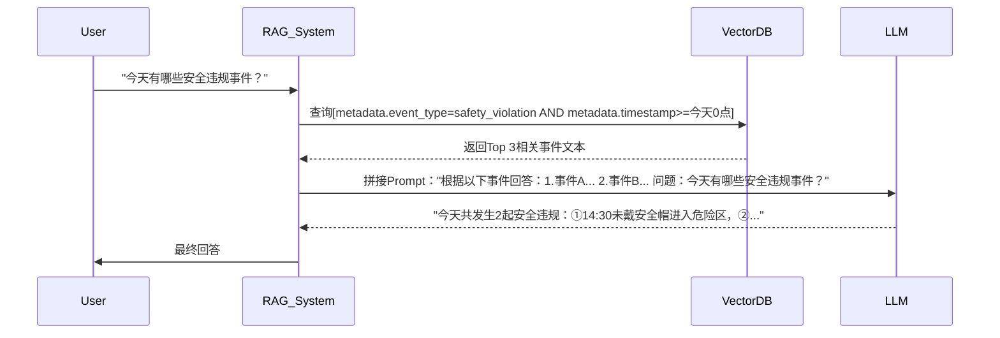

### 监控大模型

初始巨巨简陋版本v1.0.1

各种服务启动：  ./start_all.sh      （可能要多等几分钟完成环境启动）

前端web_app启动：   web_app    路径下   npm start

完了就ok了  😄

（暂时只能在88服务器上运行，后续可使用docker等容器完成环境管理）

---

rag数据结构（暂定）

| 事件id | 事件发生时间 | 事件时长 | 关键帧url | 对应视频url | 事件类型 | 事件描述 | 修正描述 |
| ------ | ------------ | -------- | --------- | ----------- | -------- | -------- | -------- |
|        |              |          |           |             |          |          |          |

目前端口使用情况：

| 端口号 | 用途                     | 说明                        |
| ------ | ------------------------ | --------------------------- |
| 8080   | rag_server               | 提供rag检索、插入数据等功能 |
| 8001   | （vllm）embedding_server | 提供接受输入后嵌入的功能    |
| 8000   | （vllm）infer_sys        | 前端大模型底层接口          |
| 8090   | quest_servel             | 前端大模型对外接口          |
| 3000   | react_proj               | 前端页面                    |

大致流程：

---

### TODO

完成对事件视频的分析、事件的存储等工作

完成事件提取（HARD）